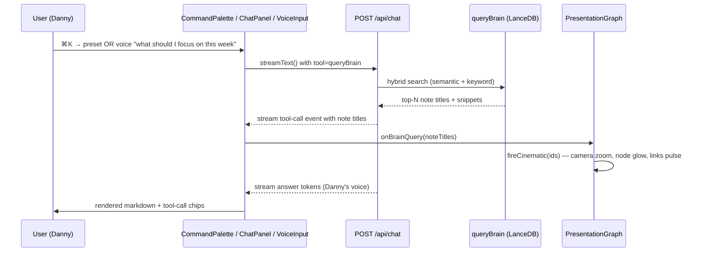
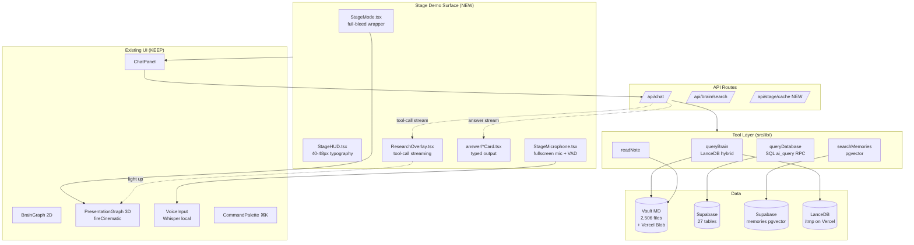

# Stage Demo Handoff — AI Danny / Second Brain

> **Audience:** the developer who will turn this into a stage-grade live demo.
> **Goal:** when Danny presses one key (or speaks into a mic) on stage, the audience sees a
> **cinematic "second brain" research → answer flow** — the brain literally lights up,
> notes are pulled, an answer streams back in Danny's voice. Watching it should feel like
> watching a person _borrow Danny's brain in real time_.
>
> **Last updated:** 2026-06-03.
> **Repo:** https://github.com/danielpaulai/Second-Brain-Obsidian.git
> **Production:** https://ai-danny.vercel.app
> **Local dev:** `./node_modules/.bin/next dev --turbopack` → http://localhost:3000

---

## 1. The pitch (what we are demoing on stage)

> "_This is my second brain. Every conversation, decision, framework, story — 10 years of work, queryable.
> What if your content creation, your decision-making, your team — could borrow your brain on demand,
> with your voice, your judgment, your context? Watch._"

Then Danny presses a key. The 3D brain rotates, nodes light up showing which notes are being read,
a researcher-style status streams ("Reading 7 calls from May…"), and an answer in his voice appears.
He can do this with **typing** or with **voice** (microphone).

The "wow" payload is two things:

1. **The brain visualization is real** — every glowing node is a real markdown file being queried.
2. **The voice is real** — the answer is generated against his actual offers, calls, frameworks, decision rules.

---

## 2. What already exists (so you don't rebuild it)

### 2.1 Data layer — three brains

| Brain          | Where                                                                                 | What it stores                                                              | API / tool                                            |
| -------------- | ------------------------------------------------------------------------------------- | --------------------------------------------------------------------------- | ----------------------------------------------------- |
| **Vault**      | `~/Documents/Obsidian/Obsidian Vault/` (~2,506 .md files, also synced to Vercel Blob) | Raw notes, meeting transcripts (Granola + Sybill), 266 distilled categories | `queryBrain` (hybrid keyword + semantic over LanceDB) |
| **Memory**     | Supabase `memories` (pgvector, 1536-dim, HNSW)                                        | Cross-session facts, commitments                                            | `searchMemories` / `storeMemories`                    |
| **Structured** | Supabase — 27 relational tables                                                       | Offers, hooks, ICPs, stories, principles, meetings, people, deals, metrics… | `queryDatabase(SELECT only)` + `describeBrain()`      |

All three are wired. All three are owner-gated (privacy enforced server-side at the tool boundary,
[src/lib/privacy.ts](src/lib/privacy.ts)).

### 2.2 Visual layer — already in place

| Component                 | File                                                                               | What it does                                                                                                                             |
| ------------------------- | ---------------------------------------------------------------------------------- | ---------------------------------------------------------------------------------------------------------------------------------------- |
| `BrainGraph`              | [src/components/BrainGraph.tsx](src/components/BrainGraph.tsx)                     | 2D force-directed canvas of every note + every wikilink. Used in daily mode.                                                             |
| `PresentationGraph`       | [src/components/PresentationGraph.tsx](src/components/PresentationGraph.tsx)       | **3D r3f Canvas** with bloom + chromatic aberration + DoF + stars + GSAP camera moves. Used in stage mode. Exposes `useFireCinematic()`. |
| `AmbientBrain`            | [src/components/AmbientBrain.tsx](src/components/AmbientBrain.tsx)                 | Background-only ambient version (used on `/ask`).                                                                                        |
| `ThinkingPulse`           | [src/components/ThinkingPulse.tsx](src/components/ThinkingPulse.tsx)               | Radial waveform + halo while Claude is generating.                                                                                       |
| `StageDeck`               | [src/components/StageDeck.tsx](src/components/StageDeck.tsx)                       | Bottom-of-screen toggle: "Live ↔ Stage". Persists choreo state to vault.                                                                 |
| `CommandPalette`          | [src/components/CommandPalette.tsx](src/components/CommandPalette.tsx)             | ⌘K palette — switch agent, run preset queries, focus a note.                                                                             |
| `ChatPanel`               | [src/components/ChatPanel.tsx](src/components/ChatPanel.tsx)                       | The 420px chat sidebar. Streams via `useChat` from `@ai-sdk/react`.                                                                      |
| `VoiceInput`              | [src/components/VoiceInput.tsx](src/components/VoiceInput.tsx)                     | **Browser-local Whisper STT** via transformers.js. No API call.                                                                          |
| `MorningBriefBanner`      | [src/components/MorningBriefBanner.tsx](src/components/MorningBriefBanner.tsx)     | Owner-only 3-tab brief at top (Pulse / Content / Intel).                                                                                 |
| `Theatre.js` choreography | [src/lib/theatre.ts](src/lib/theatre.ts)                                           | All cinematic state is editable via Theatre.js studio (toggle in StageDeck).                                                             |
| Sound + confetti          | [src/lib/sounds.ts](src/lib/sounds.ts), [src/lib/confetti.ts](src/lib/confetti.ts) | Cinema-grade audio cues + particle bursts.                                                                                               |

### 2.3 Agent layer — 5 personas already wired

[src/lib/agents.ts](src/lib/agents.ts):

| Agent     | Role                   | When to switch                    |
| --------- | ---------------------- | --------------------------------- |
| **Danny** | "You (the face)"       | Default — speaks in Danny's voice |
| **CEO**   | Strategy & direction   | Quarter planning, big bets        |
| **COO**   | Operations & execution | Process, delivery, throughput     |
| **CFO**   | Finance & cash         | Pricing, runway, margins          |
| **CMO**   | Marketing & content    | Hooks, posts, positioning         |
| **CRO**   | Revenue & sales        | Pipeline, close, objections       |

Each agent has a separate system prompt — but they all read from the same brain.

### 2.4 The cinematic loop that ALREADY WORKS

This is the thing you should preserve and amplify, not replace:



Hooks of interest:

- `ChatPanel.tsx` line ~48 — `msg.toolInvocations` is harvested → `onBrainQuery` → `fireCinematic`.
- `PresentationGraph.tsx` `useFireCinematic()` — the camera/lighting/highlight animation entry point.
- `app/page.tsx` `handleBrainQuery` — bridges the two.

---

## 3. What's missing to make it stage-grade

This is the build list. Ordered by impact-per-hour for stage polish.

### P0 — Stage Mode UX (the single biggest gap)

**Problem:** today, "Stage" mode is just a toggle that swaps 2D→3D graph. The chat sidebar still sits at 420px, the typography is laptop-sized, the brief banner still shows. **Nobody in row 12 of the auditorium can read it.**

**Build:**

1. **Full-bleed Stage Mode** — when Stage is on, hide the header, hide the chat sidebar, hide the brief banner, hide the graph hint text. The 3D brain takes the full viewport.
2. **Big stage HUD** — a single floating overlay (top-center or bottom-center) that shows:

- Current question (40–48px font)
- Live "researching" status ("📚 Reading 7 meetings · 14 frameworks · 3 case studies")
- Streaming answer in 28–32px font
- When done: a citation strip showing the 3–5 notes that were used (clickable in dev, just visible on stage)

3. **Auto-fade idle state** — after 10s of no activity in Stage mode, fade everything to just the rotating 3D brain (so Danny can talk over it without UI noise).
4. **Single-key triggers** — bind keys 1–9 to pre-baked demo scenarios (see §4). Pressing "1" should _immediately_ start the cinematic flow.

**Files to touch:**

- New: `src/components/StageMode.tsx` (the full-bleed wrapper)
- New: `src/components/StageHUD.tsx` (the typography overlay)
- Edit: `src/app/page.tsx` (when `presentationOn`, render StageMode instead of the split layout)
- Edit: `src/lib/presentation-store.ts` (already exposes `on` — add `scenario`, `phase` ('idle'|'researching'|'answering'|'done'))

**Reference:**

- The Vercel AI SDK chat example with tool-call rendering: https://sdk.vercel.ai/examples/next-app/tools
- For typography scale on stage: https://typesale.dev (use display weights 700+ at 32px+)
- For the look: think Apple keynote "AI" segments (2024) — large quiet typography, lots of negative space, motion only when meaningful.

### P1 — "Researching" visualization

**Problem:** between "user hits Enter" and "first answer token streams in" there's a 1–4s gap. Right now we show `ThinkingPulse`. On stage, this is the moment to _show the work_.

**Build:** stream **tool progress events** to the UI so the audience sees real research happen.

1. **Server side** — already streams tool calls via AI SDK. We just don't show them in flight, only after they resolve. Add a `toolCallStreaming: true` config (already supported in v4) so partial tool calls arrive earlier.
2. **Client side** — when a tool call starts, show:

- "📁 `queryBrain('client objections about pricing')` …searching 2,506 notes"
- As notes resolve, light them up on the graph one-by-one with a 60ms stagger.
- Sound cue (`sounds.ts` already has subtle whoosh) per node.

3. **For `queryDatabase`** — show the SQL plain-text in mono ("Querying `offers` table…"). The SQL itself is impressive on stage.
4. **For `searchMemories`** — show floating glyph cards with the matched memory snippets fading up.

**Files to touch:**

- Edit: `src/app/api/chat/route.ts` — ensure `experimental_toolCallStreaming` is on.
- New: `src/components/ResearchOverlay.tsx` — renders the in-flight tool call status.
- Edit: `src/components/PresentationGraph.tsx` — add `highlightProgressively(ids: string[], staggerMs)` instead of one-shot `fireCinematic`.

### P2 — Voice activation (mic-first stage flow)

**Problem:** today voice works, but you still have to click the mic, then click send. On stage, the flow should be: Danny says "Hey Danny, what should I focus on this week?" and the answer streams.

**Build:**

1. **Wake word** — use `onnxruntime-web` + a small wake-word model (Picovoice Porcupine free tier, or `vosk-browser` for fully offline). Trigger word: "Hey Danny" or just push-to-talk on spacebar.
2. **Push-to-talk fallback** — long-press spacebar to record, release to send. This is the safest stage-bet because wake words misfire under stage audio.
3. **VAD (voice activity detection)** — auto-stop recording on 1.2s of silence. (`@ricky0123/vad-web` is the de-facto lib.)
4. **Display the transcript live** — as Whisper produces partials, show them in the StageHUD so the audience sees the question form.

**Files to touch:**

- Edit: `src/components/VoiceInput.tsx` — currently only inline; add a `fullscreen` variant for Stage mode.
- New: `src/components/StageMicrophone.tsx` — full-bleed mic UI with waveform.
- Add dep: `@ricky0123/vad-web` (~80kB) for VAD.

**Reference:** the Whisper pipeline is already loaded via `transformers.js` (`@huggingface/transformers`), see [src/lib/voice.ts](src/lib/voice.ts). Don't switch to OpenAI Whisper API — local STT is the demo flex.

### P3 — Pre-baked stage scenarios

**Problem:** live queries can fail. On a stage with 500 people watching you don't want to debug a brain query. We need scripted scenarios that _feel_ live but are bulletproof.

**Build:** a `scenarios.ts` config + a "rehearsal mode" that lets Danny iterate on each scenario.

```ts
// src/lib/stage-scenarios.ts
export const SCENARIOS = [
  {
    key: "1",
    label: "Borrow my brain on positioning",
    question: "What does my brain say about positioning for B2B founders?",
    expectedTools: ["queryDatabase", "queryBrain"],
    expectedNoteIds: [
      "frameworks/positioning",
      "icp_segments/founders-b2b",
      "stories/dana-pivot",
    ],
    fallbackAnswer: `…pre-recorded answer here, used only if live call fails…`,
  },
  // …8 more
];
```

Each scenario:

- Pre-loads the relevant tool results into the graph as a "warm cache" while Danny walks on stage.
- If the live call fails (network, rate-limit), gracefully falls back to the cached answer with the same animation.
- Has a custom intro narration card (e.g. "_Watch what happens when I ask my brain about positioning…_").

**Files:**

- New: `src/lib/stage-scenarios.ts` (scenarios + cached results)
- New: `src/app/api/stage/cache/route.ts` (endpoint that pre-runs all scenarios into a JSON blob, run before walking on stage)
- Edit: `src/components/StageMode.tsx` — listen for keys 1–9, dispatch the scenario.

### P4 — Output that _looks_ like a brain answering, not a chatbot

**Problem:** the answer renders as plain markdown in a sidebar bubble. That's fine for daily, terrible for stage.

**Build:** output **typed components**, not raw markdown.

1. **Server-side answer schema** — have Claude return JSON with structured blocks: `{kind: "principle"|"story"|"number"|"quote"|"action"|"warning", body: string, source?: string}`. (`generateObject` from AI SDK v4.)
2. **Client renderers** for each kind:

- `<PrincipleCard>` — large quote-mark, italic, source chip.
- `<StoryCard>` — timeline strip ("May 12, 2024 — call with Dana") + body, with a faint "this happened" timestamp animation.
- `<NumberCard>` — huge stat (e.g. "€84,000") with sub-label.
- `<ActionCard>` — checklist items that animate in, looking like next-actions.

3. **Stagger** the cards in with 200ms between each — feels like the brain is "remembering" piece by piece.

**Files:**

- New: `src/lib/answer-schema.ts` (Zod schema)
- New: `src/components/answer/{PrincipleCard,StoryCard,NumberCard,ActionCard,QuoteCard}.tsx`
- Edit: `src/app/api/chat/route.ts` — add a "stage" mode that uses `generateObject` instead of `streamText`.

### P5 — Replay mode (recorded brain queries)

**Problem:** Danny sometimes needs to demo a query he ran two weeks ago that produced a magical answer. Re-running may not reproduce it.

**Build:** record every query (already partial via `briefings` table) — including the tool calls and node IDs — and let Danny replay one with the **full cinematic**, but using cached data. The audience can't tell the difference, and Danny gets bulletproof reliability.

**Files:**

- New migration: `0006_stage_recordings.sql` — `stage_recordings(id, scenario_key, question, tool_calls jsonb, answer text, note_ids text[], created_at)`
- New: `src/app/api/stage/record/route.ts` (start/stop a recording around a chat)
- Replay path: feed cached `tool_calls` into `fireCinematic` with original timing, then stream the cached `answer` token-by-token at ~30 tokens/sec.

### P6 — Team handoff ("they can borrow your brain too")

**Problem:** the demo's emotional payoff is "_your team can use this too._" Today, `/ask` exists for team — but it's a stripped down version. Polish it for the second half of the talk.

**Build:**

1. **Team mode** — the public `/ask` page already exists with `AmbientBrain`. Extend it so a team member can pick a persona (CEO/COO/CFO/CMO/CRO) and ask. Privacy redaction is already in place.
2. **API as a service** — expose `POST /api/brain/ask` with a per-team API key (not yet built). Returns the same structured answer cards. Lets the team integrate Danny's brain into their tools (Slack, Linear, etc.).
3. **"Borrow Danny" widget** — a 1-line script tag a teammate can drop on a webpage to embed an "ask Danny's brain" prompt. Same backend, scoped public/team tier.

**Files:**

- Edit: `src/app/ask/page.tsx`
- New: `src/app/api/brain/ask/route.ts` (token-auth, rate-limited)
- New: `public/embed.js` (the widget loader)
- New migration: `0007_team_api_keys.sql`

---

## 4. Recommended demo script (the 4-minute version)

Build the UI in a way that supports this exact flow:

| Beat               | Time | What's on screen                                                                                                                       | Trigger           |
| ------------------ | ---- | -------------------------------------------------------------------------------------------------------------------------------------- | ----------------- |
| Open               | 0:00 | 3D brain, slowly rotating, ambient particles                                                                                           | auto              |
| Question 1 (text)  | 0:30 | Stage HUD: "What did Dana say in our last call?"                                                                                       | press `1`         |
| Researching        | 0:33 | Graph zooms to `Meetings/` cluster, 3 nodes light up sequentially, status: "Reading 3 calls from May…"                                 | auto              |
| Answer streams     | 0:38 | StoryCard with date + quote + the commitment Danny made                                                                                | auto              |
| Question 2 (voice) | 1:10 | Hold spacebar, say: _"What's my best hook about pricing?"_, transcript appears live                                                    | spacebar          |
| Researching        | 1:18 | `queryDatabase` SQL appears in mono ("`SELECT hook FROM hooks WHERE topic ILIKE '%pric%'`"), graph fades, structured table glyph spins | auto              |
| Answer             | 1:22 | Big QuoteCard with the hook + 2 alternatives below                                                                                     | auto              |
| Persona switch     | 2:00 | Press `2` — "Now ask the CFO." — agent indicator changes, lighting shifts cool/blue                                                    | press `2`         |
| CFO question       | 2:05 | "What's our pricing floor for the workshop?"                                                                                           | auto              |
| Answer             | 2:12 | NumberCard ("€2,500"), with reasoning ("Based on 7 closed deals, your last 3 below this price had margin issues")                      | auto              |
| Team handoff       | 2:45 | Screen splits: left = Danny's view, right = teammate's view of `/ask` (CMO persona, redacted answers)                                  | press `3`         |
| Replay             | 3:20 | "I want to show you what this looked like 2 weeks ago — same question, watch the brain grow." Pre/post brain side-by-side              | press `4`         |
| Close              | 3:45 | Brain fades to ambient, Danny speaks final line                                                                                        | press `0` (reset) |

Note: the user-facing key bindings should be **one keystroke** (no modifiers) — Danny can't press ⌘+something while holding a clicker.

---

## 5. Visual references (pin these for the design pass)

Look-and-feel north stars:

- **Apple WWDC 2024 Apple Intelligence segment** — large quiet typography, slow motion, generous spacing, soft particles.
- **Notion AI launch keynote (Feb 2023)** — the way they showed "AI is reading your workspace" with cards lighting up sequentially.
- **The movie _Arrival_** — for the "the system is thinking and it's beautiful" energy. Specifically the heptapod ink-circles forming. Our `fireCinematic` already gestures at this.
- **GitHub Copilot Workspace launch demo** — the way the "agent is thinking" status streams in plain English.
- **Cleo (financial app) onboarding** — for tone: confident, slightly cheeky, never robotic.
- **Karpathy's "intro to LLMs" YouTube talk** — the way he visualizes context windows. Reference for the "researching" moment.

UI primitives we already lean on (keep these — don't replace):

- **Phosphor Icons** (`@phosphor-icons/react`) — the `duotone` variants are the house style.
- **Motion** (`motion/react`, formerly framer-motion) — all entrance/exit animations.
- **Theatre.js studio** — non-developers can re-choreograph stage sequences without code.
- **r3f + drei** — 3D layer.
- **Tailwind** — Tailwind v4 already configured. Color tokens in `globals.css` (`--accent-*`, `--background`, etc.).

---

## 6. Architecture at a glance



---

## 7. Hard rules — don't regress these

1. **Privacy first.** [src/lib/privacy.ts](src/lib/privacy.ts) enforces three viewer tiers. Owner = full, team = redacted, public = principles only. **Stage mode runs as owner** (Danny is signed in). The team embed runs as team. Never bypass these — it's the entire trust model.
2. **Voice is local.** Don't move STT to OpenAI Whisper API for the demo. The flex is "your voice never leaves your browser." Keep `transformers.js`.
3. **No fabrication.** The chat system prompts include hard "do not fabricate, cite the brain" rules. Skill files in `<vault>/_ai-danny/skills/*.md` enforce this. If a stage answer card has no source, it must say "_Generalizing — not in the brain_" and not invent.
4. **The brain visualization must be real.** Every glowing node = a real note that was actually read. If you light up nodes for theatrical effect that weren't queried, the moment a curious dev in the audience opens devtools, the magic dies.
5. **Stage mode must have an offline fallback.** Use the `stage_recordings` cached version if any tool call errors. Never let the audience see a red error toast.
6. **Owner sign-in is required.** Without an owner Supabase session the chat refuses `queryDatabase` / `readNote` by design. Sign in at `/login` as `danny@danielpaul.ai` before walking on stage.
7. **`pnpm dev` is broken.** Use `./node_modules/.bin/next dev --turbopack`. (Or run `pnpm approve-builds` once.)

---

## 8. File map — where everything lives

```
src/
 app/
   page.tsx                          ← split layout (graph + chat). For stage, branch on presentationOn.
   layout.tsx                        ← root, theme, providers
   api/
     chat/route.ts                   ← THE main route. tools, streaming, privacy.
     brain/
       route.ts                      ← graph data
       search/route.ts               ← hybrid semantic search
       reindex/route.ts              ← rebuild LanceDB
       note/route.ts                 ← read a single note
     brief/pre-call/route.ts         ← skill: pre-call brief
     capture/meeting/route.ts        ← Granola/Sybill webhook
     cron/{morning-brief,weekly-review,librarian}/route.ts
     draft/generate/route.ts         ← content draft engine
     knowledge/                      ← 266 distilled categories
     memories/                       ← memory store
   ask/page.tsx                      ← team-tier chat. Public-readable shell. Where embed lives.
   brain-map/page.tsx                ← 266 categories visual
   login/page.tsx                    ← Supabase auth
   memories/page.tsx                 ← memory inspector


 components/
   BrainGraph.tsx                    ← 2D canvas (daily mode)
   PresentationGraph.tsx             ← 3D r3f (stage mode)  ← key file
   AmbientBrain.tsx                  ← background-only graph (/ask)
   StageDeck.tsx                     ← Live↔Stage toggle, theatre studio
   ChatPanel.tsx                     ← chat sidebar
   VoiceInput.tsx                    ← Whisper STT  ← extend for stage
   CommandPalette.tsx                ← ⌘K palette  ← extend for scenarios
   ThinkingPulse.tsx                 ← thinking animation
   MorningBriefBanner.tsx            ← 3-tab brief
   StatsBar.tsx, HeaderBackdrop.tsx, AgentBar.tsx, AgentIcon.tsx, AskDanny.tsx
   PWARegister.tsx, PasswordGate.tsx, SmoothScrollProvider.tsx, TheatreBootstrap.tsx
   PresentationToggle.tsx
   ui/                               ← shadcn primitives (button, command, dialog, kbd)


 lib/
   agents.ts                         ← 5 personas + system prompts
   privacy.ts                        ← redaction + 3 tiers  ← DO NOT BYPASS
   brain-tools.ts                    ← queryDatabase, describeBrain
   brain-write-tools.ts              ← logMetric, addTask, upsertOffer, closeCommitment, addDecisionRule
   agent-tools.ts                    ← queryBrain, brainStats, recentNotes, readNote, listKnowledgeCategories, queryKnowledge
   skills.ts, skill-runner.ts        ← procedural knowledge loader
   structured.ts                     ← ai_query / describe_brain wrappers
   embeddings.ts                     ← OpenAI text-embedding-3-small via gateway
   semantic.ts                       ← LanceDB. INDEX_DIR is /tmp on Vercel.
   vault.ts                          ← reads from filesystem locally, Vercel Blob in prod
   knowledge.ts                      ← 266 categories
   memories.ts                       ← extract+embed+store, pgvector matching
   voice.ts                          ← Whisper transformers.js
   theatre.ts                        ← Theatre.js choreography
   presentation-store.ts             ← zustand store: stage on/off
   sounds.ts, confetti.ts            ← cinema audio + particle bursts
   cinema-audio.ts                   ← scene-level audio cues
   storage.ts                        ← local FS / Vercel Blob abstraction
   supabase/{client,server,admin}.ts


scripts/
 watch-calendar.mjs                  ← every 15min, fires /api/brief/pre-call
 sync-{sybill,granola,meetings}.mjs  ← meeting transcripts → vault → memories
 distill-{knowledge,batch,to-sql}.mjs ← vault → 27 SQL tables
 backfill-structured.mjs             ← Meetings/*.md → meetings/people/commitments
 draft-engine.mjs                    ← Queue/*.md → Generated/*.md
 librarian.mjs                       ← nightly self-cleanup
 sync-to-blob.mjs                    ← vault → Vercel Blob (already ran, 2,506 files)
 scaffold-knowledge.mjs              ← bootstrap 266 categories
 generate-icons.mjs                  ← PWA icons
 launchd/                            ← macOS launchd plists for cron


supabase/migrations/
 0001_profiles.sql                   ← profiles + role + RLS
 0002_memories.sql                   ← pgvector + match_memories RPC
 0003_briefings.sql                  ← briefings + processed_meetings (idempotency)
 0004_structured_brain.sql           ← 9 operational tables + ai_query/describe_brain
 0005_identity_knowledge.sql         ← 17 identity/knowledge tables
 0006_stage_recordings.sql           ← TODO: scenario cache
 0007_team_api_keys.sql              ← TODO: team-tier API auth


public/
 manifest.webmanifest, sw.js         ← PWA
 icon-{192,512}.png, apple-touch-icon.png
```

Tier-1 reading list for the new dev (in this order):

1. [HANDOFF.md](HANDOFF.md) — exhaustive build state.
2. [DEPLOY.md](DEPLOY.md) — production deploy notes.
3. [src/app/page.tsx](src/app/page.tsx) — entry point, layout.
4. [src/components/PresentationGraph.tsx](src/components/PresentationGraph.tsx) — the cinematic 3D layer.
5. [src/components/ChatPanel.tsx](src/components/ChatPanel.tsx) — how messages stream + how tool calls map to graph highlights.
6. [src/app/api/chat/route.ts](src/app/api/chat/route.ts) — server-side tool wiring.
7. [src/lib/agent-tools.ts](src/lib/agent-tools.ts) + [src/lib/brain-tools.ts](src/lib/brain-tools.ts) — every tool the agent can call.

---

## 9. Environment + secrets (so they can boot it)

`.env.local` is **not** committed (gitignored as `.env*.local`). Danny will share these out-of-band. Required keys:

```
ANTHROPIC_API_KEY=sk-ant-…
AI_GATEWAY_API_KEY=vck_…       (for embeddings via OpenAI gateway)
AI_MODEL=anthropic/claude-sonnet-4-6


VAULT_PATH=/Users/danielpaul/Documents/Obsidian/Obsidian Vault   (local only — empty in prod)
VAULT_EXCLUDE=.obsidian,.trash,node_modules,.git,_ai-danny


NEXT_PUBLIC_TEAM_PASSWORD=…
NEXT_PUBLIC_SUPABASE_URL=https://tcipazrkubpfjavlbytp.supabase.co
NEXT_PUBLIC_SUPABASE_ANON_KEY=eyJ…
SUPABASE_SERVICE_ROLE_KEY=eyJ…   (server-only)


OWNER_EMAIL=danny@danielpaul.ai
CRON_SECRET=…


SYBILL_API_KEY=sk_live_…
GRANOLA_API_KEY=grn_…
GCAL_CLIENT_ID=…apps.googleusercontent.com
GCAL_CLIENT_SECRET=GOCSPX-…
GCAL_REFRESH_TOKEN=1//…


BLOB_READ_WRITE_TOKEN=vercel_blob_rw_…
APP_URL=http://localhost:3000     (or https://ai-danny.vercel.app in prod)
```

Vercel already has all 17 vars set in production (added via `vercel env add`).

---

## 10. Build plan — suggested 2-week sprint for the new dev

| Day | Deliverable                                                                                                                      | Verification                                                |
| --- | -------------------------------------------------------------------------------------------------------------------------------- | ----------------------------------------------------------- |
| 1   | Read everything in §8 tier-1 list. Run locally. Sign in as owner. Run a chat query. Toggle Stage mode. Open Theatre studio.      | Chat responds, graph highlights cited notes.                |
| 2   | Build `StageMode.tsx` + `StageHUD.tsx`. Hide all chrome when on. Big typography. Test with `presentationOn=true`.                | A bare 3D brain + floating HUD on F11 fullscreen.           |
| 3   | Build `ResearchOverlay.tsx` consuming `experimental_toolCallStreaming` from AI SDK.                                              | Status text streams _during_ tool calls, not after.         |
| 4   | Convert `fireCinematic` to `highlightProgressively(ids, stagger)`. Wire from tool stream.                                        | Nodes light up one-by-one, ~60ms apart.                     |
| 5   | Build `StageMicrophone.tsx` + spacebar push-to-talk + VAD. Live transcript in HUD.                                               | Hold space, speak, release → answer streams.                |
| 6   | Add `src/lib/answer-schema.ts` (Zod). Switch chat route to `generateObject` for stage mode. Implement 5 `*Card` components.      | Answers render as typed cards, not markdown.                |
| 7   | Build `src/lib/stage-scenarios.ts` + 9 pre-baked scenarios. Bind keys 1–9.                                                       | Press `1` → cinematic flow runs end-to-end.                 |
| 8   | Build `0006_stage_recordings.sql` + `/api/stage/{record,replay}`. Record one of Danny's best past queries.                       | Replay produces same animation + cached tokens.             |
| 9   | Polish: idle fade, sound cues per node, persona-switch lighting shift (cool/blue for CFO, warm/gold for CMO, etc.).              | Scenes feel art-directed, not random.                       |
| 10  | Rehearsal mode UI — Danny can iterate on each scenario without touching code. Adjust narration cards, expected note IDs, timing. | Danny solo-edits a scenario in <2min.                       |
| 11  | `/ask` polish — persona picker, better redaction visibility (shaded "(redacted)" chips so the audience knows privacy is real).   | Side-by-side owner-vs-team view is convincing.              |
| 12  | API service `/api/brain/ask` + token table + rate-limit. `public/embed.js` widget.                                               | A teammate's localhost can curl Danny's brain with a token. |
| 13  | Full dress rehearsal. Time the script to 4 min. Catch edge cases. Add fallbacks.                                                 | 3 successful runs in a row.                                 |
| 14  | Production deploy. Smoke test on prod URL. Verify launchd cron + calendar watcher still firing. Ship.                            | Live demo on stage works.                                   |

---

## 11. Open questions for Danny

The new dev should ask Danny these before starting (or assume the recommended answer):

1. **Wake word vs push-to-talk?** _Recommended: push-to-talk on spacebar._ Wake words misfire under stage audio.
2. **Voice output (TTS) on stage?** Right now answers are text-only. Does Danny want them spoken back in his cloned voice (ElevenLabs)? _Recommended: text-only for v1; ElevenLabs cloning is a separate sprint._
3. **Stage screen aspect ratio?** Most venues are 16:9. Confirm before tuning typography.
4. **Persona lighting palette** — should each persona have its own scene color (CFO blue, CMO gold, …)? _Recommended: yes, 5 palettes, switch on `agentChange`._
5. **Recording the demo for replay marketing** — Danny will want a clean MP4 of the demo. Build a "screen capture mode" that hides cursor + dev chrome, or use OBS externally? _Recommended: external OBS, but add a `?clean=1` URL flag to hide every nonessential UI element._
6. **Live SQL on stage** — should `queryDatabase` actually show the SQL? It's impressive to engineers, confusing to non-engineers. _Recommended: show it for ~600ms then collapse to "Querying offers table…" in plain English._

---

## 12. Quick reference — commands

```bash
# Boot
cd "/Users/danielpaul/Documents/Second Brain Obsidian App"
./node_modules/.bin/next dev --turbopack


# Type check
./node_modules/.bin/tsc --noEmit


# Production build (run before pushing if touching anything in src/lib/semantic.ts or src/lib/vault.ts)
./node_modules/.bin/next build


# Re-sync vault to prod blob
node scripts/sync-to-blob.mjs


# Trigger a brief locally
curl -X POST -H "Authorization: Bearer $CRON_SECRET" \
 -H "Content-Type: application/json" \
 -d '{"who":"Dana","meetingTitle":"Workshop scoping"}' \
 http://localhost:3000/api/brief/pre-call


# Reindex semantic (needed after big vault changes)
curl -X POST -H "Authorization: Bearer $CRON_SECRET" \
 http://localhost:3000/api/brain/reindex


# Deploy
git push                        # auto-deploys via Vercel
vercel deploy --prod            # manual


# Tail prod logs
vercel logs ai-danny.vercel.app --follow
```

---

## 13. Definition of done (for the stage demo build)

The stage demo is "done" when **every one of these is true**:

- [?] Danny presses `1` and within 1.5s the brain is researching, within 4s the first answer card appears.
- [x] Holding spacebar records voice, releasing sends the question, transcript shows live in the HUD. _(2026-06-02: `VoiceDeck` — hold Space → record, release → STT → send; floating HUD shows listening/level-meter/transcribing/thinking/speaking. Needs a real mic to exercise. **2026-06-03: STT is now ON-DEVICE browser Whisper (`@huggingface/transformers` v4, WebGPU) — no OpenAI key, audio never leaves the browser.**)_
- [ ] All 9 pre-baked scenarios run end-to-end without network errors (offline cache fallback verified).
- [x] In Stage mode, the chrome (header, sidebar, brief banner) is fully hidden. _(2026-06-03: stage renders as a `fixed inset-0 z-50` full-bleed overlay over the whole app; `BrainHud` / graph hint / `MorningBriefBanner` are gated out when `mode==="stage"`; entering stage also requests browser fullscreen to drop the tab/URL chrome — `page.tsx:432`, `:362`.)_
- [ ] Typography is readable from row 12 of a 500-seat auditorium (test: 32px+ on a 13" laptop = 4ft+ on a stage screen).
- [x] Tool-call streaming makes the "researching" moment feel alive — no dead 3s pause. _(2026-06-02: retrieved notes light up **live as each `queryBrain` tool call resolves mid-stream** (harvested from `message.toolInvocations` results), so the graph scans while the brain is thinking — verified the HUD enters "◍ RECALLING" at ~4.7s while tool calls were still firing. At `onFinish` the **cited** notes (the answer's `[[wikilinks]]`) get a fresh emphasis pulse + camera-fit and the non-cited research nodes fade. Action-potential beads travel the links. Server-side `experimental_toolCallStreaming` + a dedicated `ResearchOverlay` text panel still pending.)_
- [x] Persona switch is visually obvious within 500ms (color palette changes).
- [ ] `/ask` (team mode) shows redaction chips so the audience can see "this is what your team sees" vs "this is what Danny sees."
- [ ] One of Danny's real past queries can be replayed pixel-perfect from `stage_recordings`.
- [ ] No console errors during a 4-minute run.
- [ ] A clean recording mode (`?clean=1`) hides every dev-only UI element.

### 13a. Brain visualization — "Synaptic Bloom" UI pass (2026-06-02)

The main graph element was redesigned (was: muted pastel dots on flat `#1e1e1e`). Delivered:

- [x] Shared visual module `src/lib/brain-visual.ts` — vivid on-brand folder palette, easing, sqrt-area sizing, cached glow/core/spike/bead sprites, ignition constants. Single source of truth for 2D + 3D (they can't drift again).
- [x] **Palette: "Deep Indigo Aurora"** (ui-ux-pro-max "Modern Dark / Cinema" recipe). Backgrounds deepened to clean indigo-blacks (`--background` 245 38% 4%, `ink-950 #08070f`; 2D bg gradient `#05040c→#0a0816`); ambient glows are an indigo (`#6366f1`)→cyan (`#38bdf8`) aurora; glass glow → indigo. **Nodes are a single uniform colour** (brand violet `#a78bfa` via `paletteHex`; the per-folder spectral ramp is kept in `brain-visual.ts` for an easy revert). Violet brand accent throughout.
- [x] **Calm motion at scale**: the force layout **settles once and holds still** (removed the perpetual "heartbeat" reheat; node positions persisted across resize/re-render so the layout doesn't re-scramble). **Dragging is gentle** — low reheat alpha (0.06) + soft release, so moving one node no longer vibrates the whole graph. Idle glow breathing toned down. (Aliveness = glow + occasional spontaneous synapse, not positional jitter.)
- [x] 2D `BrainGraph.tsx` rewrite: cached ink-gradient background + drifting aurora blobs + grain; always-on additive self-glow (cached sprites, no per-node gradients); gradient additive links; ambient dust; zoom-banded LOD + viewport (AABB) culling for 60fps at scale; glass tooltip; centering fix (`forceCenter`).
- [x] Marquee "nodes lighting up" — staggered per-node ignition (~75ms): flash → wobbled hand-inked shockwave ring → colour flare → action-potential beads travelling the links (one-hop cascade) → sustained lit glow → fade.
- [x] Idle "spontaneous synapse" pulses so the brain always looks like it's quietly thinking (gentle; no link beams).
- [x] 3D `PresentationGraph.tsx`: same palette, additive backdrop glow, colored-bloom via `instanceColor` brightness (verified emissive≠instanceColor), staggered 5-phase ignition, hot vertex-colored links.
- [x] Glass HUD `BrainHud.tsx`: identity + live counts, top-centre recall status pill + LIT counter, folder-colour legend; dims while dragging; `aria-live`.
- [x] Three-phase wiring: **thinking** (query in flight, no results yet — `onQueryStart`/`beginThinking`) → **research** (retrieved notes light up live as `queryBrain` calls resolve mid-stream — `ChatPanel.onResearch` from `message.toolInvocations`) → **cited** (`onFinish` extracts the answer's `[[wikilinks]]` for a final emphasis pulse via `onBrainQuery`; non-cited research nodes are demoted to fade). `presentation-store.igniteProgressive` drives the 3D graph + HUD; `onQueryStart` resets per turn.
- [x] "Thinking" animation (before any results): **per-node bioluminescent shimmer** — every node breathes a soft glow on its own desynced phase + a subtle scale pulse, tinted toward the active agent (replaced an earlier directional sonar-sweep, which was removed). HUD pill shows "◌ thinking".
- [x] Node sizing/spacing tuned so labels don't cram: `nodeRadius2D √val×3.2`; force layout spread (link 54, charge −240, collide = radius+7, ring 0.40).
- [x] Labels are **zoom-/hover-only** — cited/lit nodes do NOT auto-show their text (the glow + rim carry the signal); text appears when the user zooms in (`k ≥ 1.5`) or hovers.
- [x] **No auto-camera-move** when results arrive — the view stays exactly where the user left it.
- [x] `prefers-reduced-motion` honoured on both surfaces (no shimmer/shockwave/beads/dust/aurora/camera; calm cross-fade); keyboard-navigable canvas + screen-reader node list.
- [x] Robustness: Supabase-backed tools (`describeBrain`/`queryDatabase`) now fail soft instead of aborting the chat stream when Supabase isn't configured — so the cinematic works with just the vault + OpenAI key.
- [x] **Voice demo (push-to-talk)**: hold **Space** → record → **STT via `/api/stt` (OpenAI `whisper-1`, server-side)** → auto-send to the AI → answer **spoken back via ElevenLabs `eleven_flash_v2_5`** (~75ms latency model) through `/api/tts` (key stays server-side; voice `IKne3meq5aSn9XLyUdCD` "Charlie", override `ELEVENLABS_VOICE_ID`). `VoiceDeck` HUD shows listening/meter/transcribing/thinking/speaking; `voice-store` coordinates phase + speak-next; spacebar ignored while typing; new recording interrupts playback. Verified TTS→STT round-trip transcribes exactly (~1.9s TTS, ~2.4s STT). _Env: TTS reads `ELEVENLABS_API_KEY` or the existing `Elevel_Labs`; STT reads `OPENAI_API_KEY` (model override `STT_MODEL`)._
  - ✅ **STT is back to 100% ON-DEVICE in the browser** (2026-06-03): migrated `voice.ts` from the crash-prone `@xenova/transformers` to **`@huggingface/transformers` v4** — dynamic-imported inside a client-only `loadWhisper()` so it never evaluates during SSR/the Turbopack build (the old crash). Model `onnx-community/whisper-base.en` runs on **WebGPU** (else WASM); `stt.ts` `transcribeAudio` calls the local `transcribe()` instead of `/api/stt`; `VoiceDeck` pre-warms the model ~2.5s after mount. No OpenAI key, audio never leaves the browser. Verified in Chrome (loads via WebGPU + inference runs). Install note: `npm i @huggingface/transformers --ignore-scripts` (a full install rebuilds `sharp` from source and fails; sharp isn't needed for browser Whisper). `.en` models throw if you pass `language`/`task` to the pipeline — omit them. The old `/api/stt` (OpenAI) route is now unused. (TTS/spoken greeting still needs `ELEVENLABS_API_KEY` — no on-device TTS.)

Pending follow-ups (not this pass): server `experimental_toolCallStreaming` + a text `ResearchOverlay` panel (§3 P1 — the graph already lights up live; the streamed status text is the missing half), full per-persona scene palette shift (DoD), 3D nodes read white rather than folder-hued (emissive/instanceColor tradeoff — tune if folder colour in 3D matters). _(Full-bleed stage chrome-hide is now DONE — see §13/§13b.)_

### 13b. Stage answer rendering — token-driven block library (2026-06-03)

The stage's right-rail answer output (§3 **P4** "typed components, not raw markdown") is built and well past the original spec — it is the cinematic "the brain is answering" surface. Delivered:

- [x] **ONE reusable token-driven block library** `src/components/blocks/` renders EVERY AI answer — both general stage answers AND the LinkedIn report — from the same set (no per-surface rendering). The model writes plain markdown sprinkled with inline tokens; `parse.ts` splits them into typed blocks; `Blocks.tsx` renders rich glassmorphism UI.
- [x] **16 block types**: callout (insight/win/risk/note), keypoints, actions, stats, quote, chips, idea (LinkedIn post preview), timeline (chronology w/ node-spine), steps (numbered framework), decision (when→then→because), people (avatar roster), kpi (hero number that counts up), meter (goal-progress bars), bars (ranked comparison), define (term spotlight), table (relational data). Note-citations `[[Title]]` render as cyan source chips, not raw brackets.
- [x] **The AI actually uses them appropriately** — chat `route.ts` rule #7 is a when-to-use matrix (pick the block by the data's SHAPE: sequence→timeline, framework→steps, conditional→decision, roster→people, one hero→kpi, goal→meter, ranking→bars, definition→define, relational→table). Recap DEPTH enforced: read the full note, 6-10 timeline beats with every field filled (infer from context to fill gaps), 5-6+ blocks, never a thin skeleton, never a raw markdown table, always close every token.
- [x] **Card-first-then-content motion** (`reveal.tsx`): the frosted glass shell condenses in (blur 7→0), then its content (icon, text, rows, bars) resolves on, staggered. Shared primitive used by every block + the charts.
- [x] **STRICT-SEQUENTIAL playback** — each element fully forms (card → icon reveal → **typewriter** text / count-up / bar fill / chart draw) and only then does the NEXT element start, so a chart is never overtaken by the block after it. A subtitle waits until its title finishes typing.
- [x] **LinkedIn report**: 4 recharts (engagement area · top-posts leaderboard · reaction donut · cadence) that **FORM UP** (the card shell + empty axes appear, then the data series draws on, gated ~480ms) + a KPI strip + post-preview "idea" cards. Mock 70s scrape → real gpt-5.5 high-reasoning analysis → streamed report. Preview at `/charts-preview`.
- [x] **High-end glass tables**: a `[[table]]` block (numeric columns auto right-aligned, citations inside cells) AND raw markdown tables restyled as glass with Streamdown's copy/**download toolbar** removed (`controls={false}`); pipe parsers tolerate markdown-table syntax.
- [x] **Adaptive sizing** (short bare answers scale UP to fill the right panel), em-based prose, `prefers-reduced-motion` honoured (clean cross-fade).
- [x] **Streaming auto-scroll** follows the caret but STOPS the moment the user scrolls up (so they can re-read) and once the stream finishes (no more yank-back-to-bottom).
- [x] **Answers are silent** (only the opening greeting speaks; see [src/components/StageReadthrough.tsx](src/components/StageReadthrough.tsx)) — rich structured cards carry the answer instead.
- Surfaces: [src/components/blocks/](src/components/blocks/), [src/components/StageAnswer.tsx](src/components/StageAnswer.tsx), [src/components/StageLinkedInChat.tsx](src/components/StageLinkedInChat.tsx), [src/components/LinkedInReport.tsx](src/components/LinkedInReport.tsx), [src/components/charts/](src/components/charts/). Galleries: **`/blocks-preview`** (every block, Replay per section) and **`/charts-preview`**.
- Verified in Chrome: each block renders when expected, sequential typewriter confirmed by DOM sampling, tables render as glass with 0 toolbar buttons, scroll-follow stop verified, no console errors.

This replaces the original §3 P4 plan (separate `generateObject` + per-kind `*Card` components) with a leaner token-in-markdown approach that streams naturally and shares one renderer across surfaces.

---

## 14. Where to ask for help

- **Danny** — for product decisions, voice-tone questions, "is this on-brand?"
- **Existing handoff** — [HANDOFF.md](HANDOFF.md) for backend/data architecture.
- **Deploy questions** — [DEPLOY.md](DEPLOY.md).
- **Vercel AI SDK docs** — https://sdk.vercel.ai/docs (we use v4 + tool streaming).
- **Theatre.js** — https://www.theatrejs.com (for cinematic state Danny can edit live).
- **react-three-fiber** — https://r3f.docs.pmnd.rs (for the 3D brain).

claudGood luck. The hard part is already built — this sprint is about turning a working second brain into a stage moment people remember.
